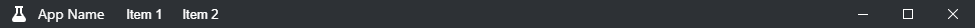
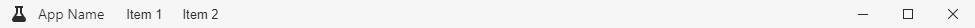
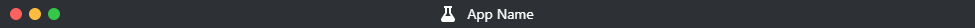
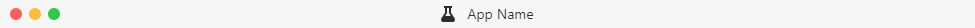

# vue-titlebar
Simple and easy to use title bar for electron  
stylesheets are written in scss and require a loader for it.

## TODO
* Write a better README
* Implement sub menus

## Installation
Install with npm:
```
npm install --save @wuild/vue-titlebar
```

```javascript
const VueTitlebar = require("@wuild/vue-titlebar");

Vue.use(VueTitlebar);
```

#### Themes / Platform









#### Properties
Name | type | default | description
---:| --- | ---| ---|
theme | String | light | theme (dark, light)
platform | String | -- | (required) specify current platform (win32, darwin, linux)
menu | Array | [] | If specified will build a simple menu on win32 and linux
isMinimizable | Boolean | true | show minimize button
isMaximizable | Boolean | true | show maximize button
isClosable | Boolean | true | show close button
onMinimize | Function | -- | if minimize button is clicked
onMaximize | Function | -- | if maximize button is clicked
onClose | Function | -- | if close button is clicked
showIcon | Boolean | true | theme (dark, light)
showTitle | Boolean | true | theme (dark, light)

#### Example

[full example](./examples/titlebar.vue)

```vue
<v-titlebar :theme="theme" :platform="platform" :on-close="close" :on-maximize="toggleMaximize"
            :on-minimize="minimize" :is-maximizable="isMaximizable" :is-closable="isClosable"
            :is-minimizable="isMinimizable" :menu="menu" :show-icon="showIcon" :show-title="showTitle">

    <template slot="icon">
        
    </template>

    <template slot="title">
        App Name
    </template>
</v-titlebar>
```
#### License
Copyright © 2018, [Wuild](https://github.com/Wuild) Released under the [MIT license](https://opensource.org/licenses/MIT).